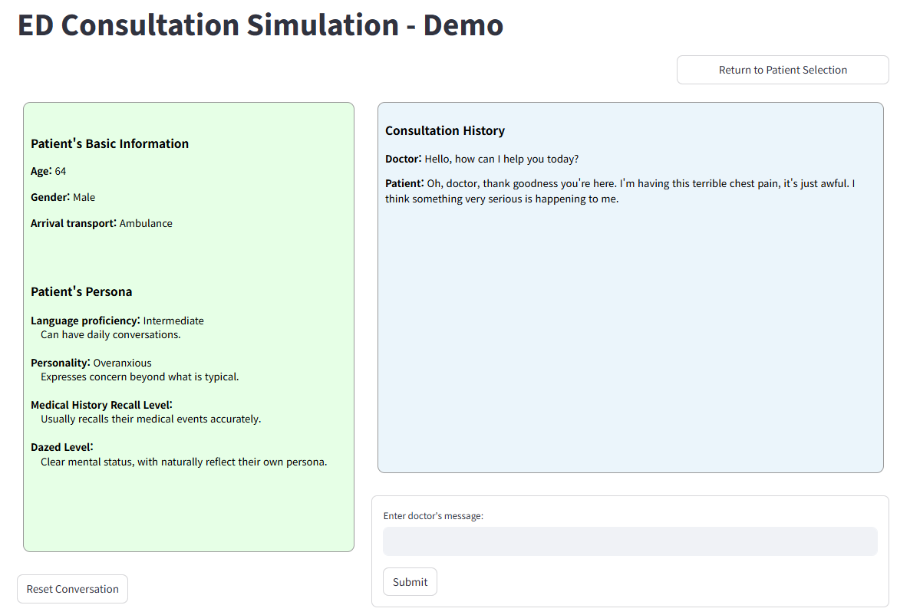

## How to Use the Demo

### Installation
This demo is implemented using Streamlit.
```
# Install required packages
pip install streamlit
```


### Run the Simulation
Before starting, make sure to set the API environment variable as described in the API Setup section of the [`README.md`](../README.md).
You can configure the patient simulator model backbone in `config.json`.
Run the simulation with:
```python
streamlit run demo.py
```


### Demo Example
1. Select the target patient and choose the persona you want to simulate.
   > Note: We provide sample patient profiles generated by GPT-5 to prevent any leakage of private data.

    <div align="center">
    
    </div>

2. You can interact with **PatientSim**, as shown below.
    - To simulate another example, press the **Return to Patient Selection** button.
    - To reset the conversation log, use the button at the bottom left.
    <div align="center">
    
    </div>

